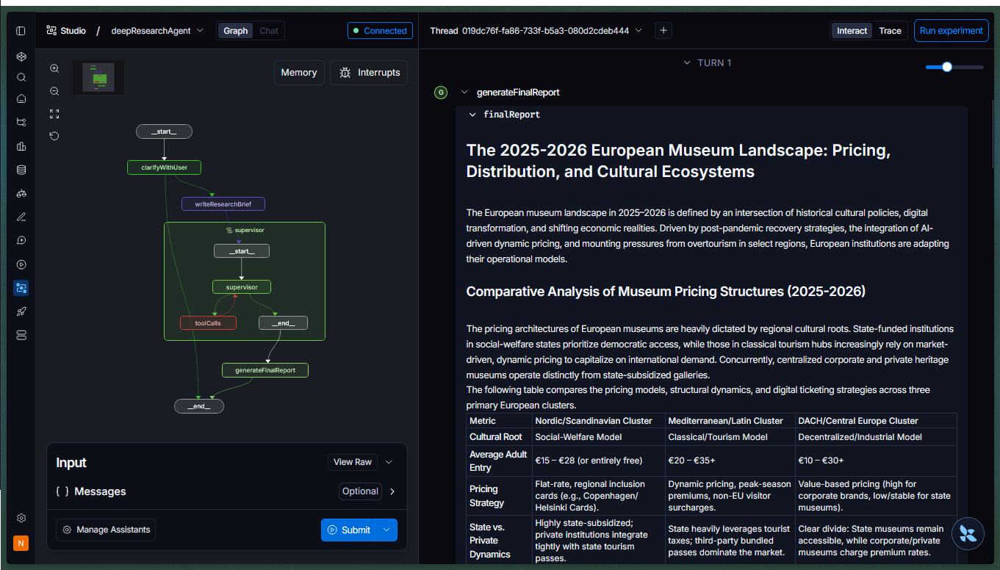

# Deep Research Agent

An autonomous research assistant designed to clarify user requests, conduct in-depth multi-step research, and generate comprehensive final reports.

> **Note:** This project is a TypeScript adaptation of the project from the Langchain Academy course ["Deep Research with LangGraph"](https://academy.langchain.com/courses/deep-research-with-langgraph) in Python. The original implementation can be found here: [research_agent_full.py](https://github.com/langchain-ai/deep_research_from_scratch/blob/main/src/deep_research_from_scratch/research_agent_full.py).

This project uses LangGraph and LLMs to manage a complex, multi-agent research workflow across four main phases:

1. **Requirement Clarification**: Engaging with the user to refine ambiguous queries into concrete research goals.
2. **Brief Generation**: Formulating a structured research brief to guide the autonomous agents.
3. **Supervised Execution**: Delegating the actual web research to specialized sub-agents under the watchful eye of a supervisor.
4. **Report Synthesis**: Compiling the gathered data into a cohesive, well-structured final report.

## Architecture & Implementation Highlights

A standout feature of this implementation is its **Hierarchical Multi-Agent Architecture**. Instead of a single monolithic graph, the system is decoupled into specialized sub-graphs (`deepResearchAgent`, `supervisorAgent`, and `researchAgent`), making it highly scalable, easier to debug, and keeping the separation of concerns clean.

The main state graph orchestrates the high-level flow with the following core nodes:
- `clarifyWithUser`: The initial conversational interface that interacts with the user to ensure the research request is clear and well-defined. It can loop back to the user until the request is actionable.
- `writeResearchBrief`: Translates the clarified user request into a detailed, actionable research brief.
- `supervisor`: A dedicated sub-agent (`supervisorAgent`) that takes the brief and manages the execution of the research tasks. It coordinates with a specialized `researchAgent` to perform the actual data gathering, ensuring the research stays on track without cluttering the main agent's state.
- `generateFinalReport`: Synthesizes all the findings collected by the supervisor and research agents into a final, comprehensive document.

## LangSmith Studio

The agent can be explored interactively in [LangSmith](https://smith.langchain.com/) using the LangGraph dev server. The graph topology is rendered live, and each node execution is traced in the right-hand panel — making it easy to inspect the multi-agent routing decisions and state transitions in real time.



## Getting Started

Implement the environments from the `.env.example` in another `.env` or `.env.local`

To install dependencies:

```bash
bun install
```

To run the LangGraph Studio development server:

```bash
bun run dev
```
*(Alternatively, you can run the agent directly via `bun run index.ts`)*

This project was created using `bun init`. [Bun](https://bun.com) is a fast all-in-one JavaScript runtime.
